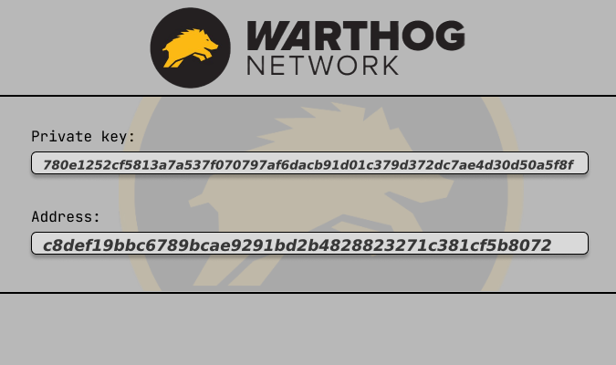

# Warthog Network multi-threaded paper wallet generator. 
If need to generate one wallet use: 
```cargo run``` or ```cargo build --release```  

To generate a large number of paper wallets use: 
```cargo run -- -c n```  or ```cargo build --release -c n```  where n:number of wallets  

the generated wallets are located along the paths: 
```target/debug/paperwallet/``` or ```target/release/paperwallet/```  

      
